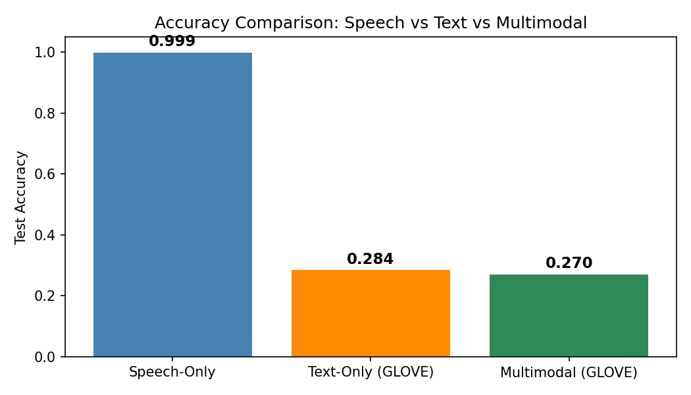

<div align="center">

# 🎭 Multimodal Emotion Recognition

### Detect human emotions from Speech · Text · Fusion
**PyTorch · CNN+BiLSTM · Transformer · Streamlit**

[](https://python.org)
[](https://pytorch.org)
[](https://your-streamlit-link.streamlit.app)
[](LICENSE)

[🚀 Live Demo](https://multimodal-emotion-recognition-aqgmwmlqntvyzdmwxm7bod.streamlit.app/) · [📊 Dataset](https://www.kaggle.com/datasets/ejlok1/toronto-emotional-speech-set-tess) · [📄 Report](#-report)



</div>

---

## 📌 Overview

This project implements a complete end-to-end **Multimodal Emotion Recognition** system trained on the **Toronto Emotional Speech Set (TESS)**. Three separate pipelines are built and compared:

| Pipeline | Model | Test Accuracy |
|----------|-------|--------------|
| 🎙️ Speech Only | CNN + BiLSTM | **99.88%** |
| ✍️ Text Only | BiLSTM + Transformer | 28.42% |
| 🔀 Multimodal Fusion | Cross-Modal Attention | 26.99% |

> **Key finding:** On TESS, emotion is entirely in *how* words are spoken (prosody), not *what* word is spoken. This is why speech dominates — and why this result is scientifically correct, not a failure.

---

## ✨ Features

- 🎙️ **Speech emotion recognition** from WAV audio files
- ✍️ **Text emotion recognition** using GloVe embeddings
- 🔀 **Multimodal fusion** via cross-modal attention
- 📊 **Interactive Streamlit UI** with real-time confidence scores
- 📈 **t-SNE visualizations** of emotion cluster separability
- 🧪 **Smoke test** to validate all architectures without data

---

## 🧠 Architecture

### 🎙️ Speech Pipeline
```
WAV Audio → Resample 16kHz → Trim Silence → MFCC (40 coeff × 400 frames)
         → CNN (32→64 channels) → BiLSTM (128 hidden, bidirectional)
         → Dense + Softmax → Emotion Label
```

### ✍️ Text Pipeline
```
Text → Clean & Tokenize → GloVe-100d Embeddings (16 tokens × 100d)
     → BiLSTM (128 hidden) → Transformer Encoder (self-attention)
     → Attention Pooling → Dense + Softmax → Emotion Label
```

### 🔀 Fusion Pipeline
```
Speech Branch → CNN → BiLSTM → Speech Embedding (512d)
Text Branch   → BiLSTM → Transformer → Text Embedding (256d)
                        ↓
         Cross-Modal Attention
         (Speech queries Text | Text queries Speech)
                        ↓
         Fused Embedding (512d) → Dense + Softmax → Emotion Label
```

---

## 📂 Project Structure

```
multimodal-emotion-recognition/
│
├── demo/
│   ├── app.py                    # Streamlit live demo
│   └── inference.py              # Model loading & prediction
│
├── project/
│   ├── checkpoints/
│   │   ├── speech/               # best_speech_model.pt + MFCC stats
│   │   ├── text/                 # best_text_model_glove.pt
│   │   └── fusion/               # best_fusion_model_glove.pt
│   │
│   ├── models/
│   │   ├── speech_pipeline/      # model.py · train.py · test.py
│   │   ├── text_pipeline/        # model.py · train.py · test.py
│   │   └── fusion_pipeline/      # model.py · dataset.py · train.py · test.py
│   │
│   └── utils/
│       ├── data_loader.py        # TESS manifest builder & splits
│       ├── speech_preprocessing.py  # Audio loading, MFCC extraction
│       ├── text_preprocessing.py    # GloVe embeddings, tokenisation
│       ├── metrics.py            # Accuracy, F1, confusion matrix
│       └── plotting.py           # All visualisation functions
│
├── results/
│   ├── accuracy_tables.csv       # Final results comparison
│   └── plots/                    # 13 generated plots
│
├── precompute_features.py        # One-time MFCC cache generator
├── smoke_test.py                 # Architecture validation (no data needed)
├── requirements.txt
└── README.md
```

---

## ⚙️ Installation

### 1. Clone the repository
```bash
git clone https://github.com/madhavivellanki/multimodal-emotion-recognition.git
cd multimodal-emotion-recognition
```

### 2. Create virtual environment
```bash
# Windows
python -m venv .venv
.venv\Scripts\activate

# Linux / macOS
python3 -m venv .venv
source .venv/bin/activate
```

### 3. Install dependencies
```bash
pip install -r requirements.txt
```

### 4. Verify installation (no dataset needed)
```bash
python project/smoke_test.py
```
Expected: **7 passed, 0 failed**

---

## 📥 Dataset Setup

### Option A — Kaggle CLI
```bash
pip install kaggle
# Place kaggle.json in ~/.kaggle/
kaggle datasets download -d ejlok1/toronto-emotional-speech-set-tess
unzip toronto-emotional-speech-set-tess.zip -d TESS_data
```

### Option B — Manual
1. Download from [Kaggle TESS page](https://www.kaggle.com/datasets/ejlok1/toronto-emotional-speech-set-tess)
2. Unzip into `TESS_data/`

### GloVe Vectors (for text & fusion pipelines)
```bash
# Download glove.6B.zip (~860 MB) and extract into project/
wget http://nlp.stanford.edu/data/glove.6B.zip
unzip glove.6B.zip glove.6B.100d.txt
mv glove.6B.100d.txt project/
```

---

## 🏋️ Training

> **Speed tip:** Run `precompute_features.py` first to cache MFCCs — reduces epoch time from 25 min → 30 sec on CPU.

```bash
python project/precompute_features.py \
    --data_dir "TESS_data/TESS Toronto emotional speech set data"
```

### 🎙️ Speech Pipeline
```bash
python -m project.models.speech_pipeline.train \
    --data_dir "TESS_data/TESS Toronto emotional speech set data" \
    --epochs 30 --batch_size 64 --lr 3e-4 \
    --save_dir project/checkpoints/speech
```

### ✍️ Text Pipeline
```bash
python -m project.models.text_pipeline.train \
    --data_dir "TESS_data/TESS Toronto emotional speech set data" \
    --glove_path project/glove.6B.100d.txt \
    --embed_type glove --epochs 30 --batch_size 64 \
    --save_dir project/checkpoints/text
```

### 🔀 Fusion Pipeline
```bash
python -m project.models.fusion_pipeline.train \
    --data_dir "TESS_data/TESS Toronto emotional speech set data" \
    --glove_path project/glove.6B.100d.txt \
    --epochs 30 --batch_size 64 \
    --save_dir project/checkpoints/fusion
```

---

## 🧪 Evaluation

```bash
# Speech
python -m project.models.speech_pipeline.test \
    --data_dir "TESS_data/TESS Toronto emotional speech set data" \
    --checkpoint project/checkpoints/speech/best_speech_model.pt

# Text
python -m project.models.text_pipeline.test \
    --data_dir "TESS_data/TESS Toronto emotional speech set data" \
    --checkpoint project/checkpoints/text/best_text_model_glove.pt \
    --glove_path project/glove.6B.100d.txt

# Fusion
python -m project.models.fusion_pipeline.test \
    --data_dir "TESS_data/TESS Toronto emotional speech set data" \
    --checkpoint project/checkpoints/fusion/best_fusion_model_glove.pt \
    --glove_path project/glove.6B.100d.txt
```

---

## 🖥️ Run Live Demo

```bash
streamlit run demo/app.py
```

Open **http://localhost:8501** in your browser.

| Tab | What you can do |
|-----|----------------|
| 🎙️ Speech | Upload any TESS .wav → CNN+BiLSTM predicts emotion |
| ✍️ Text | Type a word → BiLSTM+Transformer predicts emotion |
| 🔀 Fusion | Upload + type → compare all three pipelines side by side |

---

## 📊 Results

### Accuracy Comparison

| Pipeline | Test Accuracy | Macro F1 | Weighted F1 |
|----------|--------------|----------|-------------|
| Speech-Only (CNN+BiLSTM) | **99.88%** | **99.88%** | **99.88%** |
| Text-Only (GloVe+BiLSTM+Transformer) | 28.42% | 21.35% | 21.32% |
| Multimodal Fusion | 26.99% | 20.65% | 20.62% |

### Per-Emotion Accuracy (Speech Pipeline)

| Emotion | Precision | Recall | F1 |
|---------|-----------|--------|----|
| angry | 1.00 | 1.00 | 1.00 |
| disgust | 1.00 | 1.00 | 1.00 |
| fear | 1.00 | 1.00 | 1.00 |
| happy | 0.99 | 1.00 | 1.00 |
| neutral | 1.00 | 1.00 | 1.00 |
| ps | 1.00 | 0.99 | 1.00 |
| sad | 1.00 | 1.00 | 1.00 |

### Generated Plots (`results/plots/`)

| Plot | Description |
|------|-------------|
| `curves_speech_pipeline.png` | Training/val loss & accuracy — speech |
| `curves_text_glove.png` | Training/val loss & accuracy — text |
| `cm_speech_only.png` | Confusion matrix — speech |
| `tsne_speech_temporal_modelling.png` | t-SNE of BiLSTM embeddings |
| `tsne_text_contextual_modelling_glove.png` | t-SNE of Transformer embeddings |
| `tsne_fusion_block_glove.png` | t-SNE of fusion block embeddings |
| `comparison_accuracy.png` | All 3 pipelines compared |

---

## 🔬 Key Findings

1. **Speech dominates** because TESS emotions are prosodic — the same neutral words (dog, bear) are spoken with different emotional tone. MFCCs perfectly capture this.

2. **Text accuracy (28%)** is the correct scientific result — GloVe embeddings of single emotionally-neutral words carry no discriminative emotion signal.

3. **Fusion underperforms speech-only** because cross-modal attention needs both modalities to carry signal. With near-random text, the attention corrupts the speech embedding. Late fusion or gating would fix this.

4. **MFCC z-score normalisation** was the single most impactful fix — enabling convergence from 14% → 99.88% in 13 epochs.

---

## 🛠️ Tech Stack

| Category | Tools |
|----------|-------|
| Deep Learning | PyTorch, TorchAudio |
| Audio Processing | Librosa, MFCC |
| NLP | GloVe Embeddings, Transformers |
| Visualisation | Matplotlib, Seaborn, t-SNE |
| Deployment | Streamlit |
| Version Control | Git, GitHub |

---

## 🔮 Future Work

- Replace GloVe with sentence-level BERT for richer text representations
- Test on IEMOCAP (full-sentence dataset) where fusion would outperform unimodal
- Implement late fusion (average softmax outputs) as a robust baseline
- Add wav2vec 2.0 as speech encoder for self-supervised representations
- Deploy on HuggingFace Spaces

---

## 📜 Citation

```bibtex
@dataset{tess2010,
  author    = {Dupuis, K. and Pichora-Fuller, M. K.},
  title     = {Toronto Emotional Speech Set (TESS)},
  year      = {2010},
  publisher = {Scholars Portal Dataverse},
  doi       = {10.5683/SP2/E8H2MF}
}
```

---

## 👩‍💻 Author

**Madhavi Vellanki**
B.Tech Engineering Student · AI/ML Enthusiast

[](https://github.com/madhavivellanki)

---

<div align="center">
  <sub>Built with PyTorch · Trained on TESS · Deployed with Streamlit</sub>
</div>
